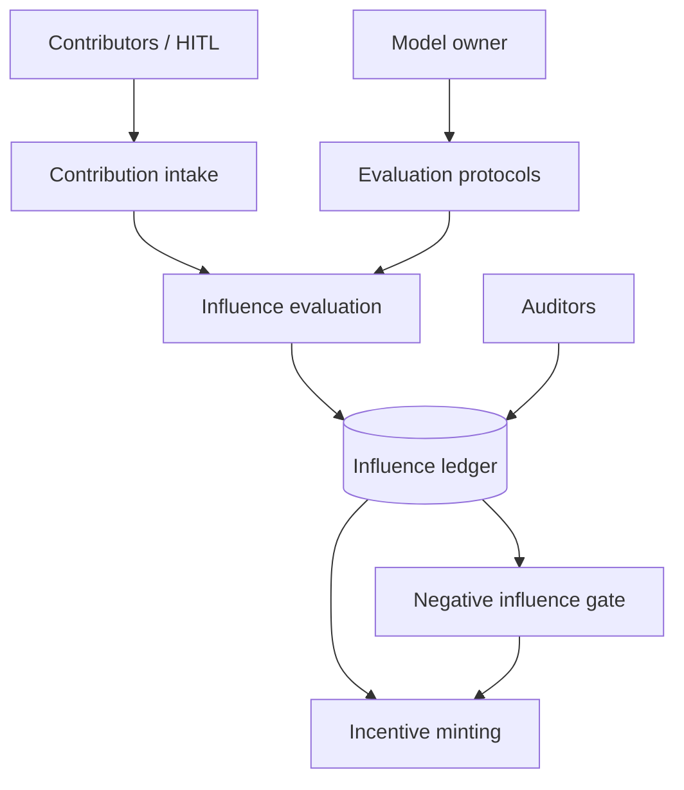

# Shapemint

**Source:** `ai-in-decentralized+ai/decentralizedai-boston-181007051624/`
**Domain:** `ai-decentralized`
**One-liner:** An influence-and-incentive ledger that measures how third parties change an AI model’s behaviour, attributes contribution weight, and settles rewards when influence is real — not merely claimed.
**Wedge:** Multi-party AI consortia (healthcare, finance, industrial) where external labs, annotators, or Effect.ai-style human-in-the-loop workers contribute to a shared model and currently cannot prove or price their influence.
**Positioning:** Boston DeepCloud thesis product. Chauhan’s Boston deck reframes centralized AI as “closed source of the 1990s” and states four problems — Privacy, Influence, Economic, Transparency — asking whether third parties can contribute in a *quantifiably influential* way and be correctly incentivized without a trusting middleman. Shapemint productises Influence + Economic (+ transparency of contribution activity) — distinct from Cipherquest (sealed weekly contests), Fedbounty (validation-lift bounties), and Rimcast (edge latency).

## Market research synthesis

### Thesis from source

The Boston deck keeps the federated learning, blockchain, homomorphic encryption, data exchange, and marketplace stack, but its unique framing is the four-challenge grid. Privacy: can entities train without disclosing data? Influence: can third parties contribute to model behaviour in a quantifiably influential way? Economic: can they be correctly incentivized for knowledge and quality? Transparency: can model activity be available to all parties without a trusting middleman? The “Other Players” slide maps SingularityNET (decentralized AI microservices), Ocean Protocol (data/services sharing), Effect.AI (decentralized Mechanical Turk / human-in-the-loop), and Distributed ML (blockchain-agnostic runtime across devices), then pitches DeepCloud AI as democratising cloud compute for providers and developers.

The commercially under-served gap among those four problems — relative to already-covered federated privacy budgets and model marketplaces — is influence metering joined to incentive settlement. Without quantified influence, economic rewards collapse into subjective reputation or winner-take-all contests; without transparent contribution logs, consortia reintroduce the middleman the deck rejects. Shapemint is the contribution-weight mint: measure behavioural influence of a submitted update, data gift, or human label batch; record it transparently; settle incentives accordingly.

### Buyer & economic model

- **Primary buyer:** AI consortium lead or Head of ML Platform funding external contributors to a shared production model.
- **Users:** external model contributors, human-in-the-loop workers, consortium auditors, incentive ops, model owners, compliance.
- **Budget owner / value metric:** share of incentive spend attributable to measured influence; reduction in unpaid or disputed contributor claims.
- **Competing status quo:** flat bounties, discretionary grants, or leaderboard contests that ignore marginal influence on live model behaviour.

### Domain constraints

- **Regulatory / trust / safety:** contribution logs must not leak training data; influence proofs must be robust to gaming and poisoning; transparency must be selective for competitors inside a consortium.
- **Data sensitivity:** gradients, labels, and evaluation traces may encode personal data; Shapemint stores influence scores and attestations, not raw contributor datasets.
- **Change-management realities:** model owners will not replace training stacks; Shapemint wraps evaluation hooks around existing promotion pipelines.

## Business requirements

- BR-1: Every accepted contribution must receive a quantified influence score against a published evaluation protocol before incentives may settle.
- BR-2: Influence scoring must be reproducible by consortium auditors without granting them raw contributor training data.
- BR-3: Incentive rules must map influence bands to payouts (or stake unlocks) in a machine-readable policy the contributor accepts pre-work.
- BR-4: Contribution activity (submit, score, accept/reject, pay) must be transparently readable to authorised parties without a discretionary middleman rewrite.
- BR-5: Privacy mode must support contributions that never disclose underlying datasets (aligned with the deck’s privacy problem).
- BR-6: Human-in-the-loop batches (Effect.ai-style) must be first-class contribution types with the same influence metering as model updates.
- BR-7: Poisoning or negative-influence contributions must be payable at zero or clawed back under policy, with a documented ruling.
- BR-8: Model owners must be able to publish which behaviours are in-scope for influence (e.g. fairness slice, accuracy on holdout) so gaming outside scope does not earn.
- BR-9: Contributors must see pending, accepted, and rejected influence with reasons, so the economic problem is solvable in practice.
- BR-10: Transparency views must support competitor isolation: parties see aggregate proofs relevant to them, not rivals’ proprietary methods.
- BR-11: Settlement statements must tie influence scores to amounts for finance and tax.
- BR-12: Governance must allow pausing incentive minting when evaluation drift is detected.

## User stories

Canonical user stories live in sibling [USER_STORIES.md](USER_STORIES.md).

## System design

### Overview

Shapemint sits beside a consortium model registry. Contributors register work (model update, dataset gift reference, HITL batch). An evaluation harness measures behavioural influence on published in-scope metrics, writes an influence record to an append-only ledger visible to authorised parties, and mints incentive obligations when policy thresholds are met. Negative-influence and dispute flows gate settlement. Privacy mode keeps raw data at the contributor; only scores and attestations enter Shapemint.

### Actors & boundaries

- **Actors:** model owners, contributors, HITL workers, auditors, incentive ops, compliance, platform operator.
- **Trust boundary:** influence ledger is the shared transparent zone; raw data and full model weights stay with owners/contributors per policy.
- **Human-in-the-loop points:** negative-influence rulings, dispute adjudication, minting pause, policy changes.

### Core capabilities

1. **Contribution intake** — model updates, data references, HITL batches.
2. **Influence evaluation** — quantified behavioural impact on in-scope metrics.
3. **Influence ledger** — append-only transparent activity for authorised parties.
4. **Incentive minting** — policy-mapped rewards and statements.
5. **Negative-influence / poison gate** — rulings and clawbacks.
6. **Privacy-preserving mode** — score-without-disclose workflows.
7. **Competitor-isolated views** — selective transparency.
8. **Governance controls** — pause, policy versioning, audit export.

### Conceptual data

- **Primary entities:** ModelRegistryEntry, Contribution, InfluenceScore, IncentivePolicy, IncentiveObligation, NegativeInfluenceRuling, TransparencyGrant, EvaluationProtocol.
- **Critical events:** contribution submitted, influence scored, accepted/rejected, incentive minted, clawback, minting paused.
- **Retention / audit needs:** influence and incentive history for the commercial and regulatory window; raw artefacts by reference only.

### Integrations (conceptual)

- **Systems of record:** model registries, MLOps promotion pipelines, payroll/crypto payout rails.
- **Upstream signals:** evaluation harnesses, HITL task platforms, federated update channels.
- **Downstream actions:** payout execution, model acceptance webhooks, contributor reputation exports (optional).

### High-level architecture

### Success metrics

- **Leading:** median hours from contribution to scored influence; share of payouts with reproducible scores; HITL batch coverage.
- **Lagging:** disputed incentive rate; measured lift per incentive dollar; contributor retention; poisoning incident rate caught pre-payout.

## OpenAPI skeleton

Canonical HTTP surface lives in sibling [openapi.yaml](openapi.yaml). Summary:

- **Base path:** `/v1/...`
- **Auth:** `X-API-Key` for evaluation harnesses; Bearer JWT for consortium operators and contributors.
- **Resource groups:** Contributions, Influence, Incentives, Protocols, Governance, Reporting.
