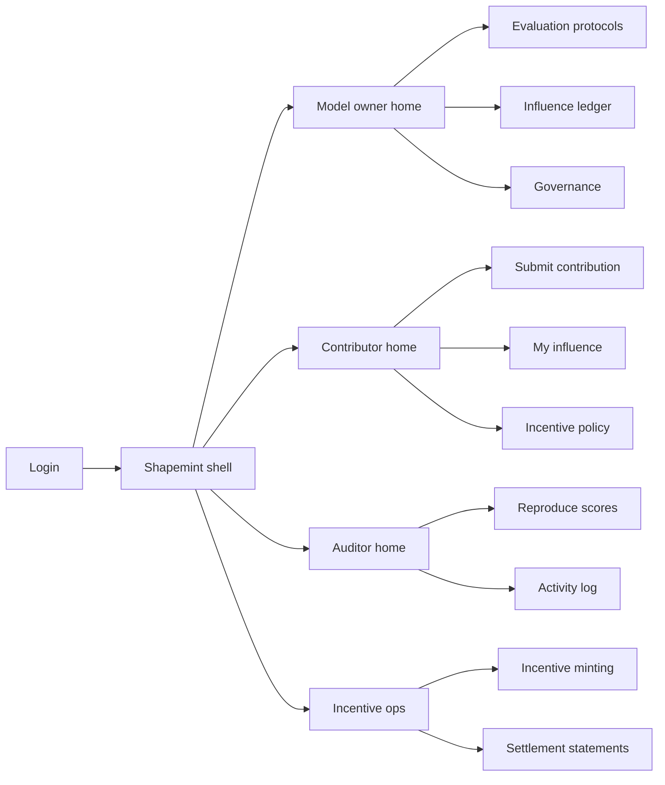
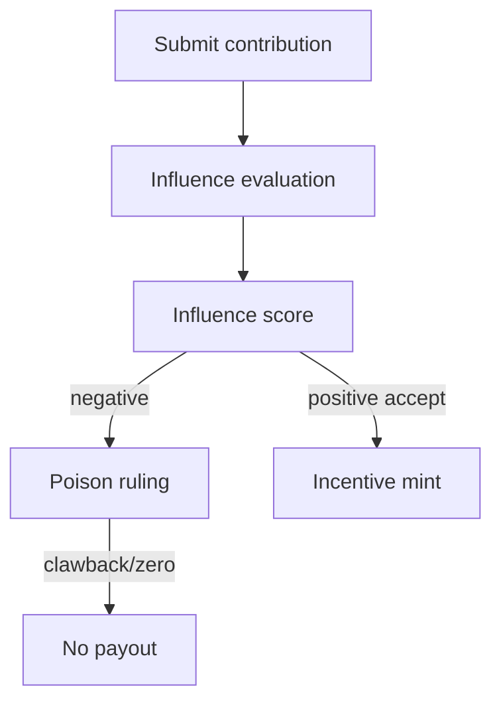

# Shapemint — Web app

**Product:** [PRODUCT.md](./PRODUCT.md)
**Primary surface:** Consortium influence-and-incentive console (Model owner + Contributor under one Shapemint shell)
**Secondary surfaces:** Auditor reproducibility workspace (read-heavy); finance settlement statement export
**Design thesis:** Shapemint is a mint for measured model influence — not a bounty leaderboard or reputation social feed. The UI metaphor is a behavioural assay: contributions enter as samples; in-scope metrics weigh how much the model’s behaviour actually moved; incentives mint only when the assay is real. Visual language is cool assay slate with mint-green for accepted positive influence and poison-coral for negative-influence holds. The brand wordmark sits as a quiet mint mark on every score and payout screen so consortia know whose contribution ledger they are trusting.

## UX research synthesis

### Category peers (best-in-class)

- **Weights & Biases / MLflow model registries:** Experiment lineage, metric comparisons, promotion gates. Steal: in-scope metric protocols as first-class objects; reject experiment-chat UX that never maps metrics to money.
- **Effect.AI / Scale / Labelbox contributor consoles:** HITL batch submission, quality scores, payouts. Steal: HITL batches as equal contribution types; reject flat per-label pay when Shapemint meters behavioural influence.
- **SingularityNET / Ocean contributor dashboards:** Service/data contribution marketplaces. Steal: transparent contribution activity without discretionary rewrite; reject microservice storefront as the primary consortium home.
- **Gitcoin Grants / quadratic funding ledgers:** Policy-mapped payouts from measured contribution. Steal: machine-readable incentive policy accepted pre-work; reject social popularity as influence proxy.

### Patterns to adopt / reject

- **Adopt:** Influence score before any payout; reproducible score packs without raw data; incentive bands from policy; HITL = model update parity; negative-influence gate; competitor-isolated transparency; minting pause on eval drift.
- **Reject:** Flat bounties as default; discretionary “thanks” grants; purple decentralized-AI glow; middleman-editable contribution history; broadcasting rival methods.

### Trust, density, and workflow constraints from PRODUCT.md

No incentive settles without quantified influence (BR-1). Auditors reproduce scores without raw datasets (BR-2). Contributors accept machine-readable policy pre-work (BR-3). Activity log is append-only for authorised parties (BR-4). Privacy mode never discloses underlying datasets (BR-5). HITL batches are first-class (BR-6). Poisoning pays zero / clawback with ruling (BR-7). In-scope behaviours are published (BR-8). Contributors see pending/accepted/rejected with reasons (BR-9). Competitor isolation in transparency (BR-10). Statements tie scores to amounts (BR-11). Governance can pause minting (BR-12).

## Information architecture

### Nav model

### Roles → default home

| Role | Default home | Why |
|------|--------------|-----|
| Consortium model owner | Owner home — influence vs treasury | In-scope pay for real change (BR-8) |
| External contributor / HITL | Contributor home — pending scores | Economic clarity (BR-9) |
| Consortium auditor | Reproduce scores | Transparency without exfil (BR-2, BR-4) |
| Incentive ops / finance | Minting + statements | Score→amount close (BR-11) |
| Compliance | Governance + isolation grants | Competitor isolation (BR-10) |

### Cross-links to OpenAPI resources

| Nav area | OpenAPI tags / resources |
|----------|---------------------------|
| Submissions (updates, data refs, HITL) | Contributions |
| Quantified scores | Influence |
| Policy-mapped rewards | Incentives |
| In-scope behaviours | Protocols |
| Pause, poison rulings | Governance |
| Audit exports | Reporting |

## Screen inventory

### Model owner home

- **Purpose:** Answer “which contributions moved in-scope behaviour, and what will we mint?” in one composition.
- **Entry:** Owner login default.
- **Layout regions:** Brand + model selector; influence inflow chart; minting paused banner if active; pending negative-influence queue; treasury obligations draft.
- **Primary actions:** Open protocol; review poison candidates; pause/resume minting.
- **Empty / loading / error:** Empty = publish first evaluation protocol; error = harness disconnect.
- **BR / story ties:** BR-1, BR-8, BR-12.

### Evaluation protocols

- **Purpose:** Publish which behaviours count for influence so out-of-scope gaming does not earn.
- **Entry:** Owner nav → Protocols.
- **Layout regions:** Protocol list; metric definitions (accuracy slice, fairness, etc.); version history; contributor-facing preview.
- **Primary actions:** Publish version; deprecate; bind to model registry entry.
- **Empty / loading / error:** No protocol = contributions cannot score.
- **BR / story ties:** BR-8, BR-1.

### Contribution intake

- **Purpose:** Accept model updates, data gift references, and HITL batches equally.
- **Entry:** Contributor default CTA; owner invite link.
- **Layout regions:** Type switcher (update / data ref / HITL); privacy-mode toggle; policy acceptance checkbox; artefact/reference fields.
- **Primary actions:** Submit; save draft; view expected band from policy.
- **Empty / loading / error:** Policy not accepted blocks submit; privacy mode hides upload of raw sets.
- **BR / story ties:** BR-3, BR-5, BR-6.

### Influence score detail

- **Purpose:** Show quantified behavioural impact with reasons for accept/reject.
- **Entry:** Ledger row; contributor “My influence.”
- **Layout regions:** Score numeral; in-scope metric breakdown; status (pending/accepted/rejected); reason codes; reproducibility pack link.
- **Primary actions:** Accept (owner); challenge; open poison ruling.
- **Empty / loading / error:** Scoring in progress skeleton.
- **BR / story ties:** BR-1, BR-9.

### Influence ledger

- **Purpose:** Append-only transparent activity for authorised parties — no discretionary rewrite.
- **Entry:** Owner/auditor nav.
- **Layout regions:** Chronological activity (submit → score → accept/reject → pay); filters by type; competitor-isolated column set.
- **Primary actions:** Export slice; open contribution; grant transparency view.
- **Empty / loading / error:** Empty consortium = invite contributors.
- **BR / story ties:** BR-4, BR-10.

### Auditor reproduce workspace

- **Purpose:** Recompute influence without raw contributor training data.
- **Entry:** Auditor home.
- **Layout regions:** Score under review; evaluation harness inputs (aggregates/attestations only); diff vs recorded score; attestation hashes.
- **Primary actions:** Run reproduce; flag drift; export audit note.
- **Empty / loading / error:** Missing attestations = blocked reproduce.
- **BR / story ties:** BR-2.

### Negative-influence gate

- **Purpose:** Document rulings that zero-pay or claw back poisoning.
- **Entry:** Owner alerts; governance.
- **Layout regions:** Suspect queue; evidence (behavioural delta); ruling form; clawback impact.
- **Primary actions:** Rule negative; clawback; notify contributor.
- **Empty / loading / error:** Empty = healthy message.
- **BR / story ties:** BR-7.

### Incentive minting

- **Purpose:** Map influence bands to payouts per accepted policy.
- **Entry:** Ops default.
- **Layout regions:** Policy band table; obligation draft list; minting pause status; HITL vs model-update mix.
- **Primary actions:** Mint draft; execute; hold for ruling.
- **Empty / loading / error:** Pause = coral block on mint; unpaid without score impossible.
- **BR / story ties:** BR-3, BR-11, BR-12.

### Settlement statements

- **Purpose:** Tie influence scores to amounts for finance/tax.
- **Entry:** Finance shortcut.
- **Layout regions:** Period statement; score→amount lines; clawbacks; export.
- **Primary actions:** Close period; download.
- **Empty / loading / error:** No minted obligations in period.
- **BR / story ties:** BR-11.

### Competitor isolation grants

- **Purpose:** Selective transparency so parties see relevant aggregates, not rival methods.
- **Entry:** Compliance nav.
- **Layout regions:** Party matrix; field visibility; aggregate-only toggles.
- **Primary actions:** Grant/revoke; simulate party view.
- **Empty / loading / error:** Default-deny for rival method fields.
- **BR / story ties:** BR-10.

## Key flows

1. **Contribute → score → mint** — submit (privacy optional) → influence eval on protocol → accept → mint per bands; failure: negative ruling blocks pay.

2. **Protocol publish** — define in-scope behaviours → contributor policy accept → submissions unlock (BR-8, BR-3).

3. **Auditor reproduce** — open score → run harness on attestations → confirm or flag drift (BR-2).

4. **Minting pause** — detect eval drift → pause mint → investigate → resume (BR-12).

5. **HITL parity** — label batch submit → same influence metering as model update (BR-6).

## Design system

### Tokens (CSS variables)

- `--color-ink: #E8EEF2` — primary text
- `--color-assay-950: #0B1218` — app ground
- `--color-assay-900: #141C26` — panels
- `--color-assay-700: #2A3848` — dividers
- `--color-mint: #3DCC8C` — positive influence / minted
- `--color-mint-dim: #1F6B4A` — mint on dark
- `--color-amber: #E0A045` — pending score
- `--color-coral: #E85D4C` — negative influence / pause
- `--color-steel: #7A93A8` — secondary labels
- `--color-brand: #9FD9B8` — Shapemint wordmark
- `--font-display: "DM Sans", sans-serif`
- `--font-mono: "DM Mono", monospace` — contribution ids, score hashes
- `--space-1`…`--space-8`: 4px scale
- `--radius-sm: 4px`; `--radius-md: 8px`
- `--motion-mint: 180ms ease-out` — incentive mint flash
- `--motion-score: 200ms ease-out` — influence score land
- `--motion-pause: 240ms ease-in-out` — minting pause pulse
- Atmosphere: subtle assay-grid on slate panels; cool laboratory depth — not purple DAO neon.

### Typography & brand

- Display for influence numerals and mint amounts; mono for contribution and attestation ids.
- Brand wordmark on ledger and minting screens.
- Login: brand hero; headline (“Pay for measured influence”); one CTA.

### Do / don’t

- **Do:** Score before pay; HITL parity; append-only ledger; competitor-isolated columns; pause on drift.
- **Don’t:** Flat bounty default; editable history; raw dataset in auditor UI; purple glow.

### Accessibility & domain trust cues

- AA+ contrast; status never colour-only.
- Live regions for mint pause and poison rulings.
- Focus: protocol → submit → score → mint → statement.

## Component patterns

- **InfluenceScoreMeter** — quantified behavioural impact with in-scope breakdown.
- **IncentiveBandTable** — policy mapping accepted pre-work.
- **HitlParityBadge** — annotation batch as first-class contribution.
- **NegativeInfluenceRuling** — zero/clawback with evidence.
- **AppendOnlyActivityRow** — immutable contribution lifecycle event.
- **ReproducePack** — auditor recompute without raw data.
- **MintPauseBanner** — governance halt on eval drift.
- **CompetitorIsolationMatrix** — selective transparency grants.

## Out of scope for v1 web

- Full federated training orchestration; sealed weekly contest product (Cipherquest); edge latency mesh (Rimcast); general compute marketplace (DeepCloud pitch); social reputation feeds; replacement of owner’s primary MLOps IDE.
